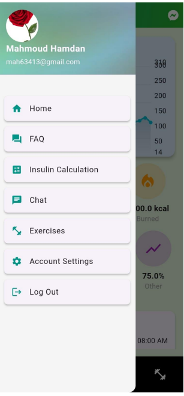

# Diabetes Support & Prediction App

This is a mobile application designed to assist people with diabetes by providing a reliable machine learning-based prediction system and a range of supportive features to manage their daily life.

## 📱 App Features

- 🔍 **Diabetes Prediction**: Uses trained ML models to predict diabetes risk based on user input.
- 🥗 **Food System + Insulin Dose Calculator**: Calculates appropriate insulin doses based on food intake.
- 🏃 **Home-Based Sport Activities**: Suggested workouts tailored for diabetic users.
- 📍 **Nearby Diabetes Centers**: Google Maps integration to locate the nearest diabetes support facilities.
- 📈 **Blood Glucose Visualization**: Track and visualize your glucose history with charts.
- 💬 **Chat with Doctors**: Communicate directly with healthcare professionals.
- 🌐 **Doctor Feed**: Share experiences, tips, and motivation with other users.

## 🤖 Machine Learning

- Preprocessing and feature engineering on diabetes datasets.
- Balancing algorithms to handle class imbalances.
- Multiple ML models trained and evaluated using accuracy, precision, recall, and F1-score.
- Final model exposed via Flask API and connected to the app frontend.

## 🧰 Tech Stack

- **Frontend**: Flutter
- **Backend**: Python + Flask
- **ML Models**: Scikit-learn, Pandas, NumPy
- **Maps**: Google Maps API
- **Chat**: Firebase 
- **Data Visualization**: Matplotlib / Flutter Charts

## Screenshots

## 🤝 Contributors

* [Omar Masalmah](https://github.com/Omarmasalmah) 
* [Mahmoud Hamdan](https://github.com/mahmoudbzu)   
* [Yazeed Hamdan](https://github.com/YazeedHamdan1201133) 
